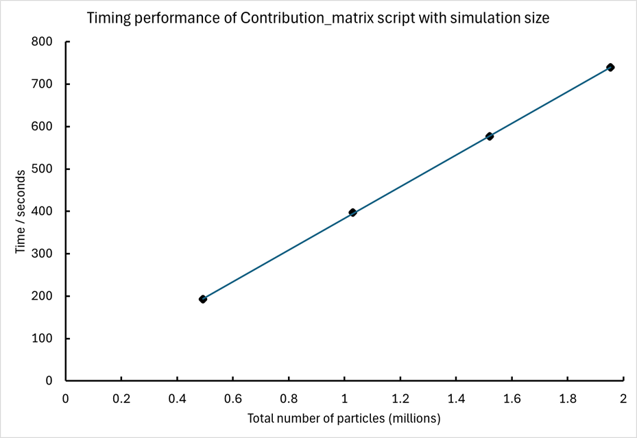
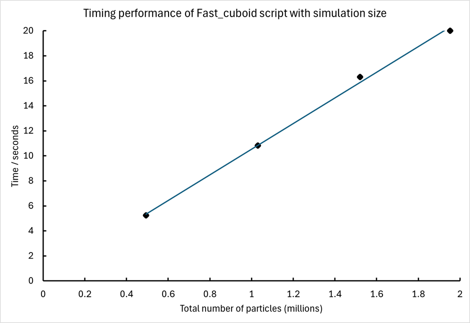
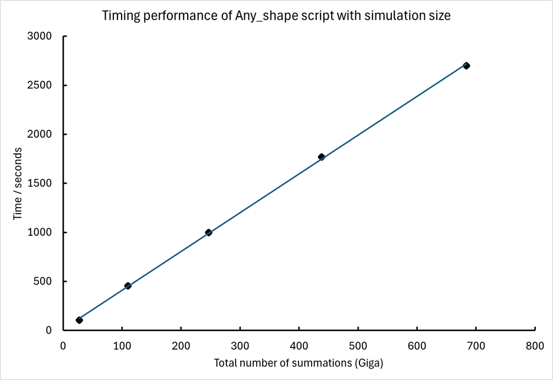

# Demagnetisation factor information of packed magnetic particles

## Overview

The purpose of this project is to calculate the demagnetisation factor of a sample consisting of discrete magnetic elements. The inspiration for this came from making measurements using a susceptometer on samples of magnetic nanoparticles (spherical particles) packed into cuboid tubes, and requiring an accurate value of the respective demagnetisation factor. [The initial work is documented here.](https://pubs.aip.org/aip/adv/article/12/7/075212/2819260)

The early model was only applied to cuboid sample containers and had a summation process that was simple but inefficient, with its summation process containing a high number of duplications. In the code presented here, the efficiency of the summation process is improved and can be applied to any sample container shape. A paper containing a detailed explanation of the new code, with results and a comparison with demagnetisation factors in the literature, is currently under review. [Script performance is discussed at the end of this document.](#script-performance)

Regardless of the container shape, the initial step is to define a cuboid lattice that is of sufficient size to hold the required shape, which is carried out in the Contribution_matrix MATLAB script. By examining only a single spherical particle, its self-demagnetisation field at its centre and contributions to it generated by identical particles placed at different points in the lattice were calculated with the assumption that the particles were saturated in the z-axis direction. The next step is to perform a summation of the contributions, where there are three options to select from depending on the required sample shape. 

* [Fast_cuboid.m](#fast_cuboid) calculates the demagnetisation information for a cuboid sample shape using a technique that improves efficiency compared to a simple summation. The elements in the output matrix hold the demagnetisation factor of each particle in the sample lattice, mapping the element position with the actual position in the sample. 

* [Uniform2D.m](#uniform2d) calculates a similar equivalent final matrix as Fast_cuboid. However, the sample shape is defined by a 2D fixed cross-section (x-y plane) perpendicular to the "applied magnetic field". The 2D cross-section is created by the user with a matrix which uses "0" or "1" to denote the absence or presence of a particle. This "mask" matrix can be either entered manually or can be generated by another script beforehand. An example is given here: [script cylinderA](#cylindera) generates a circular 2D pattern (diameter of 101 particles) which, when used in Uniform2D, produces a cylinder. Uniform2D uses the majority of efficient techniques, as in Fast_cuboid.

* [Any_shape.m](#any_shape) calculates the average demagnetisation factor of the constituent particles held in a sample of any shape, as defined by the user. It was not possible to utilise the fast summation techniques used in Fast_cuboid, so the process used here is based on regression to the mean, with the user specifying how many of the constituent particles' demagnetisation factors are calculated. This reduces the computational time compared with a simple summation process, but at the expense of not being able to generate a full spatial distribution matrix. As for Uniform2D, the user defines the shape of the sample using a "mask" matrix that can be either generated manually or created beforehand by another script. An example is given here: the [script ellipsoid](#ellipsoid) creates a mask of an ellipsoid shape, with x and y set to the same size and the z-axis approximately nine times longer. Note that it is relatively easy to adapt the Any_shape script to calculate the demagnetisation factor of every constituent particle so that the spatial distribution matrix can be found. However, please note that this would use a simple summation process and would be computationally laborious compared to Fast_cuboid.

For flexibility and efficiency, if a user wants to investigate samples of different sizes, the dimensions in Contribution_matrix are set to the largest required values. Subsequently, when using the appropriate summation script, the x, y, and z dimensions are set to the required values.

## The scripts: some detail

#### Contribution_matrix.m

This script calculates the self-demagnetisation field of a spherical magnetic particle and the contributions to the demagnetisation field in the z-axis direction generated by other identical particles positioned such that they form a simple cubic lattice with the initial particle at one of the vertices. The user defines the size of the lattice by stating the number of particles to be considered in the three orthogonal axes; the higher the total number of particles, the more refined the final outcome against the increased computational time. The user also defines the spacing of the particles by specifying the volume packing fraction, with a maximum for a simple cubic structure of &pi;/6 (the particles would be touching). In this case, the script is set to produce a cubic structure of touching particles with a side length of 101 particles. 

User input:

* **xlength, ylength, and zlength** are single values that define the size of the lattice (container sample size) in terms of the number of particles along the x-, y-, and z-axes.
* **vpf** is the volume packing fraction, a single value should be given, greater than zero but less than or equal to &pi; / 6.

Output required for the summation scripts:

* **Nz** is a matrix of dimensions (xlength, ylength, zlength). Each element holds the contribution to the demagnetisation factor in the z-axis direction for a particle centred at the origin of the lattice. The index of each element corresponds to the lattice position of the particle providing the contribution, with element 1, 1, 1 holding the self-demagnetisation field of the particle at the origin of the lattice.

### Summation scripts

All three summation scripts have similar initial requirements, with the user having to specify the x, y, and z lengths of the cubic lattice (xlength, ylength, and zlength). It is possible to take the dimensions specified in the initial integration script Contribution_matrix. However, if we want to examine several different sample sizes, it is efficient to run Contribution_matrix at the largest required dimension size and then perform repeated runs of the summation script, specifying the required dimensions each time. All summation scripts create a new matrix, Nzfull, that puts the contribution data from matrix Nz, created in the Contribution_matrix script, into a convenient format for summation.

#### Fast_cuboid.m

This script is used to obtain the demagnetisation information for a sample in the form of a cuboid. It uses the matrix Nz created in the program Contribution_matrix and performs a series of summations with the final output contained in the matrix Demagmatrix. Each element of Demagmatrix is the demagnetisation factor of a particle in that particle location in the sample. Note that Demagmatrix is in the SI.

Input:

* **xlength, ylength, and zlength** are single values that define the size of the cuboid sample in terms of the number of particles along the x-, y-, and z-axes. These values must be less than or equal to the dimensions of the Nz matrix.
* **Nz**: matrix containing the demagnetisation contribution factors created in the Contribution_matrix script.

Output:

* The mean, maximum, and minimum values of the demagnetisation factors of the constituent particles.
* **Demagmatrix**: A 3D matrix whose elements are the values of the demagnetisation factors of the individual constituent particles.

#### Uniform2D.m

This summation program finds the demagnetisation information for a sample with a uniform cross-section in which the applied magnetic field is applied perpendicular to; cylinders being the most common non-cubic example. It uses similar summations as for the Fast_cuboid program but now has to consider particles that are either absent or present when a summation is made in a "cuboid" matrix. This is done using a 2D matrix that uses "0" or "1" to indicate the absence or presence of a particle within this cross-section. [Further information on these "mask" matrices is provided later in this document.](#mask-matrices)

Same input requirements as for Fast_cuboid with the addition of:

* **Othello**; a 2D matrix, that has dimensions matching the desired lattice size in the x-y plane, whose values are either "0" or "1", representing the absence or presence of a particle in the lattice. The user can either manually enter the data or alternately use a script to generate it, such as the cylinderA script example provided in this repository. 

The output is of the same nature as that of the Fast_cuboid script. The absence of particles in the lattice is represented in the Demagmatrix matrix by NaN.

#### Any_shape.m

This summation program finds the demagnetisation information for a container sample of any given shape. Because the summation process used by the other summation programs cannot be used here, to reduce the computational time, this program only finds the demagnetisation factor for a user-defined fraction of the total number of constituent particles (variable frac) and uses regression to the mean to calculate the mean of the sample. Like the Uniform2D program, the summations used here require a mask matrix (Othello) to indicate the absence or presence of a particle ("0" or "1" respectively), in this case a 3D matrix. [The mask matrices are discussed later in this document.](#mask-matrices)

Same input requirements as for Fast_cuboid with the addition of:

* **frac**: A single value between zero and one that represents the fraction of constituent particles to be examined. The default value in the script was set at 0.05.

* **Othello**; a 3D matrix that has dimensions matching the desired lattice size whose values are either "0" or "1", representing the absence or presence of a particle in the lattice. The user can either manually enter the data or alternately use a script to generate it, such as the ellipsoid script example given here in this repository.

Output:

* Mean, maximum, and minimum values of the demagnetisation factors of the constituent particles (based on the sampled particles).

* **Demagmatrix**: A 3D matrix whose elements are either the demagnetisation factors of the particles sampled, with element position matching that of the actual location, or NaN for non-sampled or absent particles.

### Mask matrices

For the summation programs Uniform2D and Any_shape, summations will occur that will include positions in the lattice that have no particles. The absence or presence of a particle at a given position is denoted by "0" or "1" respectively. Uniform2D requires a 2D mask matrix defining the shape of the cross-section, whereas Any_shape requires a 3D matrix defining the overall shape. Such matrices can be created by simply entering "0" or "1" into the required positions or by using scripts to define a shape: example scripts have been provided in this repository and are described below.

#### cylinderA

This generated a 2D mask matrix of dimensions 101 X 101, with particles present in a circular pattern. A cylindrical sample was created when used in the Uniform2D program. 

#### ellipsoid

This program generates a 3D mask matrix in the form of an ellipsoid with equally sized x- and y-axes (101 particles) and a major axis in the z-direction (901 particles in the direction of the applied field). This mask matrix was used with the Any_shape program. During testing, a range of ellipsoids were examined: the corresponding Othello mask matrices are included here in the folder "Ellipse Othello", common x and y dimensions of 101 particles and a z dimension increasing in steps of 100, from 101 to 1001 particles.

## Script performance

The scripts were written in MATLAB R2022b and tested using a desktop computer with Windows 11. The PC had an Intel i5-10400F CPU with a base speed of 2.90 GHz, six cores, and twelve logical processors. The timing performance of each script was determined using MATLAB profiler. The performance test data generated by the profiler were recorded and stored in the "Performance files" folder in this repository. 
The most time-consuming aspect is the integration performed as part of the Contribution_matrix script.  The script was run four times with the profiler on, increasing the number of particles in the lattice from approximately half a million to two million. A summary of the timing data is provided in [Figure 1](#figure-1), with the script taking 374 seconds to process the contribution of one million particles.

##### Figure 1

For cubic samples, lattices of the same size were used in the Fast-cuboid script as above. The timing data are shown in [Figure 2](#figure-2), with the script taking 10.2 seconds to process one million particles. Uniform2D uses some of the same summation techniques as Fast_cuboid but loses efficiency, having to consider the mask matrix defining the 2D cross section: for cylinders, Uniform 2D is typically about 27.7 seconds per million lattice spaces.

##### Figure 2

Performance testing of Any_shape was carried out on ellipsoid container shapes that consisted of touching particles with x- and y-axis side lengths held at 101 particles. In five separate simulations, the z-axis was varied from 101 to 501 particles in steps of 100. In each run, 5% of the total particles present in the lattice were sampled. Because the runtime of Any_shape is affected by both the size of the lattice and the fraction of the particles to sample, the performance of this script is illustrated by the time required to carry out a billion (one Giga) summations with the number of summations being equal to the number of particles sampled (percentage of particles sampled multiplied by the number of particles present in the lattice as defined by the mask matrix Othello) multiplied by the lattice size. The results are summarised in [Figure 3](#figure-3), with this script taking 3.95 seconds to perform a billion summations. 

##### Figure 3

## License

This project is licensed under the terms of the MIT license included in this repository.